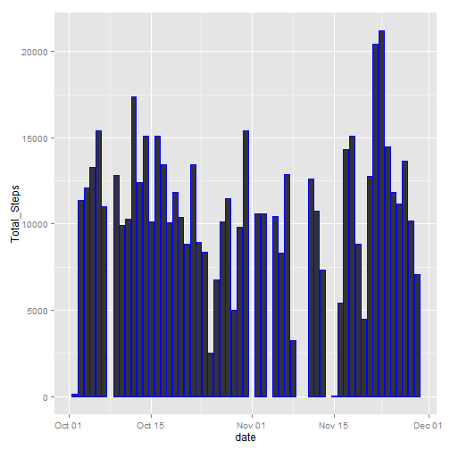
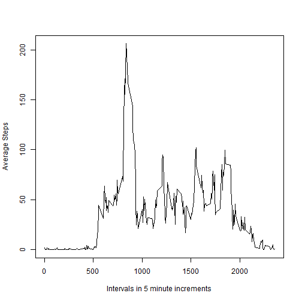
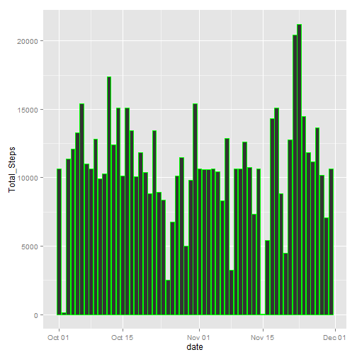
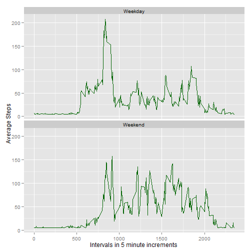

### Reproducible Research: Peer Assessment 1

##### by Dave Porcaro

#### Introduction

This document contains the text and code for a data analysis on data from a personal monitoring device.  The data has three variables:

- the number of steps taken in a five minute interval
- the date on which the measurement was taken
- an identifier for the 5 minute interval in which the measurement was taken

The data are contained in a csv file called 'activity.csv'

#### First Step:  Load the data, explore it, and then process / transform it to prepare it for analysis


```r
activity <- read.csv("activity.csv")
```

Exploring will create some summary data, so I installed the xtable package to make the summary data more readable.


```r
library(xtable)
```


First I called summary.


```r
xt1 <- xtable(summary(activity))
print(xt1, type = "html")
```

<!-- html table generated in R 3.1.2 by xtable 1.7-4 package -->
<!-- Sat Jan 17 15:36:44 2015 -->
<table border=1>
<tr> <th>  </th> <th>     steps </th> <th>         date </th> <th>    interval </th>  </tr>
  <tr> <td align="right"> 1 </td> <td> Min.   :  0.00   </td> <td> 2012-10-01:  288   </td> <td> Min.   :   0.0   </td> </tr>
  <tr> <td align="right"> 2 </td> <td> 1st Qu.:  0.00   </td> <td> 2012-10-02:  288   </td> <td> 1st Qu.: 588.8   </td> </tr>
  <tr> <td align="right"> 3 </td> <td> Median :  0.00   </td> <td> 2012-10-03:  288   </td> <td> Median :1177.5   </td> </tr>
  <tr> <td align="right"> 4 </td> <td> Mean   : 37.38   </td> <td> 2012-10-04:  288   </td> <td> Mean   :1177.5   </td> </tr>
  <tr> <td align="right"> 5 </td> <td> 3rd Qu.: 12.00   </td> <td> 2012-10-05:  288   </td> <td> 3rd Qu.:1766.2   </td> </tr>
  <tr> <td align="right"> 6 </td> <td> Max.   :806.00   </td> <td> 2012-10-06:  288   </td> <td> Max.   :2355.0   </td> </tr>
  <tr> <td align="right"> 7 </td> <td> NA's   :2304   </td> <td> (Other)   :15840   </td> <td>  </td> </tr>
   </table>


Then I called str


```r
str(activity)
```

```
## 'data.frame':	17568 obs. of  3 variables:
##  $ steps   : int  NA NA NA NA NA NA NA NA NA NA ...
##  $ date    : Factor w/ 61 levels "2012-10-01","2012-10-02",..: 1 1 1 1 1 1 1 1 1 1 ...
##  $ interval: int  0 5 10 15 20 25 30 35 40 45 ...
```


There are 2304 NA values in the data, so let's remove them before we do our first analysis.  I also note that the dates are not in a date format, which could complicate plotting later.  I call our cleaned up data "Steps" and then call summary and str on it to see what's changed.


```r
Steps <- na.omit(activity)
```


```r
xt2 <- xtable(summary(Steps))
print(xt2, type = "html")
```

<!-- html table generated in R 3.1.2 by xtable 1.7-4 package -->
<!-- Sat Jan 17 15:36:44 2015 -->
<table border=1>
<tr> <th>  </th> <th>     steps </th> <th>         date </th> <th>    interval </th>  </tr>
  <tr> <td align="right"> 1 </td> <td> Min.   :  0.00   </td> <td> 2012-10-02:  288   </td> <td> Min.   :   0.0   </td> </tr>
  <tr> <td align="right"> 2 </td> <td> 1st Qu.:  0.00   </td> <td> 2012-10-03:  288   </td> <td> 1st Qu.: 588.8   </td> </tr>
  <tr> <td align="right"> 3 </td> <td> Median :  0.00   </td> <td> 2012-10-04:  288   </td> <td> Median :1177.5   </td> </tr>
  <tr> <td align="right"> 4 </td> <td> Mean   : 37.38   </td> <td> 2012-10-05:  288   </td> <td> Mean   :1177.5   </td> </tr>
  <tr> <td align="right"> 5 </td> <td> 3rd Qu.: 12.00   </td> <td> 2012-10-06:  288   </td> <td> 3rd Qu.:1766.2   </td> </tr>
  <tr> <td align="right"> 6 </td> <td> Max.   :806.00   </td> <td> 2012-10-07:  288   </td> <td> Max.   :2355.0   </td> </tr>
  <tr> <td align="right"> 7 </td> <td>  </td> <td> (Other)   :13536   </td> <td>  </td> </tr>
   </table>


```r
str(Steps)
```

```
## 'data.frame':	15264 obs. of  3 variables:
##  $ steps   : int  0 0 0 0 0 0 0 0 0 0 ...
##  $ date    : Factor w/ 61 levels "2012-10-01","2012-10-02",..: 2 2 2 2 2 2 2 2 2 2 ...
##  $ interval: int  0 5 10 15 20 25 30 35 40 45 ...
##  - attr(*, "na.action")=Class 'omit'  Named int [1:2304] 1 2 3 4 5 6 7 8 9 10 ...
##   .. ..- attr(*, "names")= chr [1:2304] "1" "2" "3" "4" ...
```

#### Second Step:  Calculate the total number of steps each day, make a histogram, and calculate mean and median.  

To total the steps, I created a data table, called Steps.DT.  I loaded ggplot2 for making a histogram later in the document.


```r
library(data.table)
```

```
## data.table 1.9.4  For help type: ?data.table
## *** NB: by=.EACHI is now explicit. See README to restore previous behaviour.
```

```r
Steps.DT <- data.table(Steps)
library(ggplot2)
```

Then I totaled the steps and created a histogram to show the total number of steps taken each day.  


```r
Total <- Steps.DT[,list(Total_Steps=sum(steps)), by='date']
Total$date <- as.Date(Total$date)
g <- ggplot(Total, aes(date, Total_Steps))
g + geom_histogram(stat="identity", color = "blue")
```

 

I also called summary on the data table to calculate the mean and median total number of steps taken per day.


```r
xt3 <- xtable(summary(Total))
print(xt3, type = "html")
```

<!-- html table generated in R 3.1.2 by xtable 1.7-4 package -->
<!-- Sat Jan 17 15:36:46 2015 -->
<table border=1>
<tr> <th>  </th> <th>      date </th> <th>  Total_Steps </th>  </tr>
  <tr> <td align="right"> 1 </td> <td> Min.   :2012-10-02   </td> <td> Min.   :   41   </td> </tr>
  <tr> <td align="right"> 2 </td> <td> 1st Qu.:2012-10-16   </td> <td> 1st Qu.: 8841   </td> </tr>
  <tr> <td align="right"> 3 </td> <td> Median :2012-10-29   </td> <td> Median :10765   </td> </tr>
  <tr> <td align="right"> 4 </td> <td> Mean   :2012-10-30   </td> <td> Mean   :10766   </td> </tr>
  <tr> <td align="right"> 5 </td> <td> 3rd Qu.:2012-11-16   </td> <td> 3rd Qu.:13294   </td> </tr>
  <tr> <td align="right"> 6 </td> <td> Max.   :2012-11-29   </td> <td> Max.   :21194   </td> </tr>
   </table>

The table above shows the **mean is 10766** and the **median is 10765**.

#### Third Step:  Make a time series plot of the five minute intervals (x-axis) and the average number of steps taken, averaged across all days (y-axis)

I calculated the average steps per interval and looked at a summary of the result in order to get a feel for how a time series plot would look, in particluar I was interested in the mean and maximum.  The mean I used in the Fourth Step in replacing NAs, and the maximum is needed to answer a later part of the Third Step.


```r
Average <- Steps.DT[,list(Average_Steps=mean(steps)), by='interval']
xt4 <- xtable(summary(Average))
print(xt4, type = "html")
```

<!-- html table generated in R 3.1.2 by xtable 1.7-4 package -->
<!-- Sat Jan 17 15:36:46 2015 -->
<table border=1>
<tr> <th>  </th> <th>    interval </th> <th> Average_Steps </th>  </tr>
  <tr> <td align="right"> 1 </td> <td> Min.   :   0.0   </td> <td> Min.   :  0.000   </td> </tr>
  <tr> <td align="right"> 2 </td> <td> 1st Qu.: 588.8   </td> <td> 1st Qu.:  2.486   </td> </tr>
  <tr> <td align="right"> 3 </td> <td> Median :1177.5   </td> <td> Median : 34.113   </td> </tr>
  <tr> <td align="right"> 4 </td> <td> Mean   :1177.5   </td> <td> Mean   : 37.383   </td> </tr>
  <tr> <td align="right"> 5 </td> <td> 3rd Qu.:1766.2   </td> <td> 3rd Qu.: 52.835   </td> </tr>
  <tr> <td align="right"> 6 </td> <td> Max.   :2355.0   </td> <td> Max.   :206.170   </td> </tr>
   </table>

Then I plotted the data


```r
plot(Average$interval, Average$Average_Steps, type = "l", xlab = "Intervals in 5 minute increments", ylab = "Average Steps")
```

 

After plotting, I reordered the data to find which interval, on average across all days, contained the maximum number of steps.


```r
Average[order(Average$Average_Steps),]
```

```
##      interval Average_Steps
##   1:       40        0.0000
##   2:      120        0.0000
##   3:      155        0.0000
##   4:      200        0.0000
##   5:      205        0.0000
##  ---                       
## 284:      830      177.3019
## 285:      845      179.5660
## 286:      850      183.3962
## 287:      840      195.9245
## 288:      835      206.1698
```

From the output, it appeares **interval 835 has the maximum steps**.  This matches the time series plot.

#### Fourth Step:  Calculate the number of NAs, fill in the NA values with data, create a new dataset with no NA values, and make a histogram of the number of steps, calculate and report the mean and median total number of steps.

The number of NAs was calculated earlier in this analysis; **the number of NAs is 2304**.

To fill in the missing values of the data set, I replaced all NAs in the "steps" column with the average number of steps taken, averaged across all days, or 37.383, a number which was calculated in the Third Step, above.  The r code requires data.table, which is already installed, so I created a data table from the original data set called No.NA.DT.


```r
No.NA.DT <- as.data.table(activity)
suppressWarnings(for (col in "steps") No.NA.DT[is.na(get(col)), (col) := 37.383])
```

Just to verify all the NAs are gone, I used is.na and called str


```r
sum(is.na(No.NA.DT$steps))
```

```
## [1] 0
```

```r
str(No.NA.DT)
```

```
## Classes 'data.table' and 'data.frame':	17568 obs. of  3 variables:
##  $ steps   : int  37 37 37 37 37 37 37 37 37 37 ...
##  $ date    : Factor w/ 61 levels "2012-10-01","2012-10-02",..: 1 1 1 1 1 1 1 1 1 1 ...
##  $ interval: int  0 5 10 15 20 25 30 35 40 45 ...
##  - attr(*, ".internal.selfref")=<externalptr>
```

To make the histogram, I plotted from the data set with no NA values, No.NA.DT


```r
TotalNoNA <- No.NA.DT[,list(Total_Steps=sum(steps)), by='date']
TotalNoNA$date <- as.Date(TotalNoNA$date)
g <- ggplot(TotalNoNA, aes(date, Total_Steps))
g + geom_histogram(stat="identity", color = "green")
```

 

I also called summary on the data table to calculate the mean and median total number of steps taken per day.


```r
xt5 <- xtable(summary(TotalNoNA))
print(xt5, type = "html")
```

<!-- html table generated in R 3.1.2 by xtable 1.7-4 package -->
<!-- Sat Jan 17 15:36:46 2015 -->
<table border=1>
<tr> <th>  </th> <th>      date </th> <th>  Total_Steps </th>  </tr>
  <tr> <td align="right"> 1 </td> <td> Min.   :2012-10-01   </td> <td> Min.   :   41   </td> </tr>
  <tr> <td align="right"> 2 </td> <td> 1st Qu.:2012-10-16   </td> <td> 1st Qu.: 9819   </td> </tr>
  <tr> <td align="right"> 3 </td> <td> Median :2012-10-31   </td> <td> Median :10656   </td> </tr>
  <tr> <td align="right"> 4 </td> <td> Mean   :2012-10-31   </td> <td> Mean   :10752   </td> </tr>
  <tr> <td align="right"> 5 </td> <td> 3rd Qu.:2012-11-15   </td> <td> 3rd Qu.:12811   </td> </tr>
  <tr> <td align="right"> 6 </td> <td> Max.   :2012-11-30   </td> <td> Max.   :21194   </td> </tr>
   </table>

In order to compare the mean and median of the modified data set without NA values (in the table immediately above) to the mean and median of the original data set, I reprinted the summary data table of the original data set below.


```r
print(xt3, type = "html")
```

<!-- html table generated in R 3.1.2 by xtable 1.7-4 package -->
<!-- Sat Jan 17 15:36:46 2015 -->
<table border=1>
<tr> <th>  </th> <th>      date </th> <th>  Total_Steps </th>  </tr>
  <tr> <td align="right"> 1 </td> <td> Min.   :2012-10-02   </td> <td> Min.   :   41   </td> </tr>
  <tr> <td align="right"> 2 </td> <td> 1st Qu.:2012-10-16   </td> <td> 1st Qu.: 8841   </td> </tr>
  <tr> <td align="right"> 3 </td> <td> Median :2012-10-29   </td> <td> Median :10765   </td> </tr>
  <tr> <td align="right"> 4 </td> <td> Mean   :2012-10-30   </td> <td> Mean   :10766   </td> </tr>
  <tr> <td align="right"> 5 </td> <td> 3rd Qu.:2012-11-16   </td> <td> 3rd Qu.:13294   </td> </tr>
  <tr> <td align="right"> 6 </td> <td> Max.   :2012-11-29   </td> <td> Max.   :21194   </td> </tr>
   </table>

Looking at the two tables simultaneously allows us to see that imputing a value of 37.383 in place of NA **reduced the median from 10765 to 10656 and reduced the mean from 10766 to 10752**.

#### Fifth Step:  Determine whether there are differences in activity pattern between weekdays and weekends using the data set with no NA values (No.NA.DT) by creating two time series plots, one for weekdays and one for weekends.  

I used the weekdays function to create a character vector, Weekdays, that contained the weekday names.  I used cbind to connect the No.NA.DT data set to the character vector with weekday names, creating a new data set with three columns.  Then I replaced the Weekday names with either "Weekday" or "Weekend" as appropriate.  


```r
No.NA.DT$date <- as.Date(No.NA.DT$date)
Weekdays <- weekdays(No.NA.DT$date)
NoNAWeekdays <- cbind(No.NA.DT, Weekdays)
NoNAWeekdays$Weekdays[NoNAWeekdays$Weekdays =="Monday" | NoNAWeekdays$Weekdays=="Tuesday" | NoNAWeekdays$Weekdays == "Wednesday" | NoNAWeekdays$Weekdays == "Thursday" | NoNAWeekdays$Weekdays == "Friday"] <- "Weekday"
NoNAWeekdays$Weekdays[NoNAWeekdays$Weekdays =="Saturday" | NoNAWeekdays$Weekdays=="Sunday"] <- "Weekend"         
```

Using code similar to that found in the Third Step, above, I calculated the average steps per interval to prepare to make a time series plot, once for the Weekdays, and once for the Weekends.


```r
split_df <- split(NoNAWeekdays, f = NoNAWeekdays$Weekdays)  ## split on weekend and weekday
Y <- lapply(seq_along(split_df), function(x) as.data.frame(split_df[[x]])[, 1:3])
WeekdaysOnly <- as.data.table(Y[[1]])
AverageNoNAWeekdays <- WeekdaysOnly[,list(Average_Steps=mean(steps)), by='interval']
MF <- "Weekday"
AverageNoNAWeekdays <- cbind(AverageNoNAWeekdays, MF)
setnames(AverageNoNAWeekdays, "MF", "Weekday")

WeekendsOnly <- as.data.table(Y[[2]])
AverageNoNAWeekends <- WeekendsOnly[,list(Average_Steps=mean(steps)), by='interval']
SS <- "Weekend"
AverageNoNAWeekends <- cbind(AverageNoNAWeekends, SS)
setnames(AverageNoNAWeekends, "SS", "Weekday")

AverageNoNA <- rbind(AverageNoNAWeekdays, AverageNoNAWeekends)

g <- ggplot(AverageNoNA, aes(interval, Average_Steps))
g + geom_line(color = "dark green") + facet_wrap(~ Weekday, nrow = 2, ncol = 1) + labs(x = "Intervals in 5 minute increments", y = "Average Steps")
```

 

A quick visual review of the two plots indicates there are differences in activity patterns between weekdays and weekends.  On weekends, there are more steps in the middle of the day, and the subject appears to stay up later into the evening.
